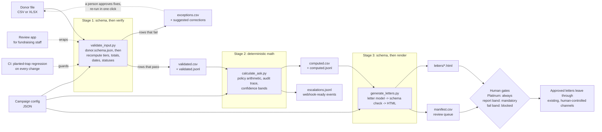

# Charity Donor Outreach, Rebuilt

A case study in turning a plausible-looking AI prompt into a governed, testable system.

The brief: a nonprofit technology consultant drafted an AI agent skill, [charity-donor-outreach](original/charity-donor-outreach/SKILL.md), to help ASPCA fundraising staff generate personalized donor letters at scale. The task was to assess it, describe improvements and their impact, and rewrite it. The short diagnosis: the original skill asks a language model to be the database, calculator, compliance reviewer, copywriter, and delivery channel at once. The rebuild keeps those jobs separate: code verifies the data and computes the rules, the model is optional and bounded, and a person reviews anything consequential before it leaves the system. The full reasoning behind that diagnosis, problem by problem, is in the [design review](docs/design-review/README.md).

## Review path

If you read only three things, read these in order:

1. **[Assessment](assessment/ASSESSMENT.md):** the direct answer to the two case-study questions.
2. **[Rewritten skill](skill/charity-donor-outreach/SKILL.md):** the concise operational version an agent would follow.
3. **[Standalone HTML review artifact](deliverable/donor-data-review.html):** the interactive deliverable for reviewing the supplied data, applying corrections, and exporting a cleaned batch.

The rest of the repository is implementation evidence: tests, generated output, decision records, and scale notes showing where production extensions would attach without changing the core design.

## Contents

- [Review path](#review-path)
- [Results on the case-study data](#results-on-the-case-study-data)
- [How the pipeline works](#how-the-pipeline-works)
- [Try it](#try-it)
- [Standalone review artifact](#standalone-review-artifact)
- [Requirements checklist](#requirements-checklist)
- [Where everything lives](#where-everything-lives)
- [Design principles](#design-principles)

## Results on the case-study data

The original skill's own 50-donor table, transcribed verbatim into [a test fixture](skill/charity-donor-outreach/assets/sample_donors.csv) with its planted errors intact:

| Check | Original skill | Rebuilt pipeline |
|---|---|---|
| Mislabeled donor tiers | Trusted, wrong ask sent | **4 caught and held**, with suggested fixes; manual review of the same table had found only 3 |
| Gift totals vs gift history | Never checked | Tied out on every row, every run |
| Ask arithmetic | In-model, path-dependent formula | Deterministic script, one rounding step, [audit trace per donor](skill/charity-donor-outreach/scripts/donor_rules.py) |
| Unconfirmed "your gift will be matched" | Instructed | Structurally impossible, [test-enforced](tests/test_pipeline.py) |
| Gender guessed from first names | Instructed | Removed, test-enforced |
| Missing data | "Make reasonable assumptions" | Exceptions report; a person approves fixes, one click resubmits |
| Uncertain records | Indistinguishable from clean ones | Confidence rubric: below 0.70 blocked, below 0.90 held and escalated |
| Letters | Free-form HTML in chat | Validated against a [schema](skill/charity-donor-outreach/references/letter_schema.json) as data, then rendered to files with a review manifest |
| Hostile input | Trusted | CSV formula injection neutralized, uploads capped, donor text is data, never instructions |
| Tests | None | **140**, re-run with the planted traps by [CI](.github/workflows/ci.yml) on every change |

Full analysis: the [design review](docs/design-review/README.md) examines the original problem by problem with validity verdicts, and the [trap registry](docs/trap-registry.md) maps every planted defect to the mechanism that catches it and the test that proves it.

## How the pipeline works

Data first: nothing generates until the data is verified, corrected, or held back. Each stage is a separate script that can be run, tested, and audited alone.



Nothing in this system sends anything. The output of a run is a folder of drafts, a review checklist, and a set of structured artifacts (validation report, corrections, escalations, letter models, run metrics).

Want to see it happen rather than read about it? [`docs/run-walkthrough.md`](docs/run-walkthrough.md) runs the real fixture through every stage above, stop by stop, with the actual command, the actual output, and a plain-language explanation alongside an engineering note at each one, readable at any technical level.

## Try it

Requires Python 3.10 or newer. The core CSV pipeline uses the standard library; `openpyxl` enables Excel input, `pandas` and `streamlit` serve the review app, and `pytest` runs the tests. Install the optional review/test dependencies before running the full suite locally.

```bash
python -m pip install openpyxl pandas streamlit pytest

# The three stages, against the sample data (catches all four planted traps)
python skill/charity-donor-outreach/scripts/validate_input.py \
  --input skill/charity-donor-outreach/assets/sample_donors.csv \
  --config skill/charity-donor-outreach/assets/campaign_config.example.json
python skill/charity-donor-outreach/scripts/calculate_ask.py \
  --config skill/charity-donor-outreach/assets/campaign_config.example.json
python skill/charity-donor-outreach/scripts/generate_letters.py \
  --config skill/charity-donor-outreach/assets/campaign_config.example.json

# Approve the suggested fixes and resubmit: exceptions drop from 4 to 0
python skill/charity-donor-outreach/scripts/apply_corrections.py \
  --input skill/charity-donor-outreach/assets/sample_donors.csv \
  --corrections work/corrections.csv --output work/donors_corrected.csv

# The test suite
python -m pytest tests -q

# The review interface for non-technical staff
# (tutorial mode and a narrated audio walkthrough are sidebar toggles)
streamlit run app/review_app.py
```

A completed run is committed in [output/](output/) as evidence: the [review manifest](output/manifest.csv) and all 44 drafted letters.

## Standalone review artifact

**Live, no download:** https://flyguytestrun.github.io/ASPCA-Case-Study/deliverable/donor-data-review.html

Or, [deliverable/donor-data-review.html](deliverable/donor-data-review.html) opens in any browser, no install, no server, no network. It is the reviewer-facing version of the case study: it shows the verified result, explains the pipeline, lets a reviewer inspect all 50 donors, apply suggested corrections, upload another file in the same shape, and export a cleaned batch for the next pipeline run. Expanding a donor row shows the generated letter and ask trace from the real pipeline output, not browser-synthesized content. Mandatory-review donors must be checked off before the page will download a dated archive containing the cleaned data, letters, and manifest. Details and rebuild instructions: [deliverable/README.md](deliverable/README.md); design records: [ADR 0021](docs/adr/0021-standalone-review-artifact.md), [ADR 0029](docs/adr/0029-browser-side-upload-clean-and-persist.md), [ADR 0030](docs/adr/0030-letter-preview-and-date-display.md), [ADR 0035](docs/adr/0035-html-review-gate-and-dated-archive.md).

## Requirements checklist

[docs/requirements-checklist.md](docs/requirements-checklist.md) answers, one at a time and by name, the specific controls a production AI system review looks for: schema validation, required field validation, input sanitization, failure handling, audit logging, structured JSON between processing stages, separation of prompt, data, and business logic, elimination of hallucination-prone calculations, removal of unethical instructions, regression testing, and versioned business rules. Each item links directly to the file, ADR, and test that satisfies it, not a claim.

## Where everything lives

| Document | What it is |
|---|---|
| [Assessment](assessment/ASSESSMENT.md) | The written case-study response: findings, impact, the rewrite, the production path |
| [Run walkthrough](docs/run-walkthrough.md) | A real run, stop by stop: the command, the actual output, and a plain-language plus technical explanation at every stage |
| [Requirements checklist](docs/requirements-checklist.md) | Every production-readiness control, named, hyperlinked to its implementation and its test |
| [Design review](docs/design-review/README.md) | The original skill examined problem by problem, each with a validity verdict, the fix, and what changes at scale |
| [Components guide](docs/components.md) | Every script, reference file, and interface explained for both non-technical readers and engineers |
| [Decision records](docs/adr/) | 36 ADRs: one per correction, each with the problem, the decision, and the forward impact |
| [Decision history](docs/decision-log/) | ADR-style entries the running system writes for itself: applied corrections, style adoptions, batch sign-offs, each with a named approver |
| [Trap registry](docs/trap-registry.md) | Every planted defect: where it hides, how it is caught, the test that proves it |
| [Scale architecture](docs/scale-architecture.md) | What gets built when volume demands it, and the trigger for each addition |
| [Rewritten skill](skill/charity-donor-outreach/SKILL.md) | The lean instruction file: judgment only, no math, no guessing, nothing sent |
| [Standalone review artifact](deliverable/donor-data-review.html) | Open in any browser: the interactive HTML deliverable for reviewing, correcting, uploading, and exporting donor data |
| [Hours log](HOURS.md) | Time spent on this engagement, block by block |

## Design principles

1. **The data is the asset; treat it first.** Verification and correction happen before any generation, and the gift history, not the labels on it, is the source of truth.
2. **Code for what must be exact, a model for what must be human.** Arithmetic, dates, tiers, schemas, and gates are deterministic and tested; language stays inside an approved library and bounded personalization rules.
3. **Identify, never speculate.** Every record is verified, or flagged with the specific reason. Below 0.70 confidence the system stops; production AI must know when it does not know.
4. **Every decision leaves a trail.** Ask traces, run metrics, escalation events, corrections logs, decision records: any output can be explained to a donor, an auditor, or a new teammate.
5. **People before process.** The review app teaches as it goes, in plain language, because the person who knows the donors should be able to run the checks without an engineer in the room.
