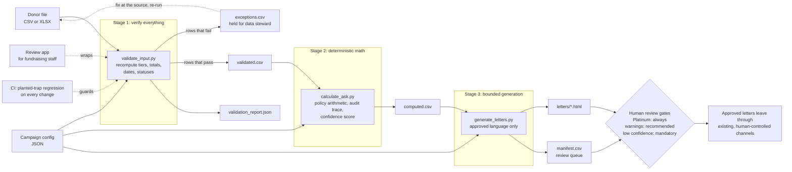

# Charity Donor Outreach, Rebuilt

A case study in turning a plausible-looking AI skill into a production-grade system.

The brief: a nonprofit technology consultant drafted an AI agent skill, [charity-donor-outreach](original/charity-donor-outreach/SKILL.md), to help ASPCA fundraising staff generate personalized donor letters at scale. The task was to assess it, describe improvements and their impact, and rewrite it. The full written assessment is in [assessment/ASSESSMENT.md](assessment/ASSESSMENT.md). This README is the working tour of the rebuilt system.

The one-sentence diagnosis: the original skill asked a language model to be a database, a calculator, a compliance officer, and a mail room all at once, and it trusted every byte of input on faith. The rebuild gives each of those jobs to the right tool and trusts nothing it can verify instead.

## Headline results on the case-study data

The original skill's own 50-donor table, transcribed verbatim into [a test fixture](skill/charity-donor-outreach/assets/sample_donors.csv), planted errors included:

| Check | Original skill | Rebuilt pipeline |
|---|---|---|
| Mislabeled donor tiers | Trusted, wrong ask sent | **4 caught**, held for review with exact reasons |
| Tier traps found by manual review of the same table | 3 | **4** (computed checks caught one a careful human missed) |
| Gift totals cross-checked against gift history | Never | Every row, every run |
| Ask arithmetic | In-model, formula rounds mid-sequence, undefined "last year" | Deterministic script, rounds once, defined terms, [audit trace per donor](skill/charity-donor-outreach/scripts/donor_rules.py) |
| Unconfirmed "your gift will be matched" claim | Instructed to make it | Structurally impossible, [enforced by tests](tests/test_pipeline.py) |
| Gender guessed from first names | Instructed | Removed, tested for |
| Missing data | "Make reasonable assumptions and proceed" | Routed to an exceptions report, never fabricated |
| Output | HTML pasted into chat | Files, review manifest, human gates |
| Found errors | Dead end | Suggested fixes a person approves, then one-click resubmit |
| Reviewer edits | Lost | Learned as style, after repeated evidence and named approval, personality only |
| Tests | None | 61, run on every change by [CI](.github/workflows/ci.yml) |

The donor whom manual review missed: Shirley Magnusdottir, filed as Silver with $22,000 lifetime giving, which the policy computes to Gold. Three other traps (Ruth Andersen, Ada Yamamoto-Pierce, Arthur Mwangi) were caught by both methods. That gap between careful reading and computed verification is the case for this architecture in miniature.

## How the pipeline works

Data first: nothing touches letter generation until the data has been parsed, verified, and corrected or held back. The stages are separate scripts so each can be run, tested, and audited alone.



Nothing in this system sends anything. The output of a run is a folder of drafts and a review checklist.

## Try it

Requires Python 3.10 or newer. The pipeline itself uses only the standard library (plus `openpyxl` for Excel input); `pandas` and `streamlit` are used by the review app, `pytest` by the tests.

```bash
# 1. Validate: catches the four planted traps in the sample data
python skill/charity-donor-outreach/scripts/validate_input.py \
  --input skill/charity-donor-outreach/assets/sample_donors.csv \
  --config skill/charity-donor-outreach/assets/campaign_config.example.json

# 2. Calculate asks with per-donor audit traces
python skill/charity-donor-outreach/scripts/calculate_ask.py \
  --config skill/charity-donor-outreach/assets/campaign_config.example.json

# 3. Generate letters and the review manifest
python skill/charity-donor-outreach/scripts/generate_letters.py \
  --config skill/charity-donor-outreach/assets/campaign_config.example.json

# Approve the suggested fixes and resubmit: exceptions drop from 4 to 0
python skill/charity-donor-outreach/scripts/apply_corrections.py \
  --input skill/charity-donor-outreach/assets/sample_donors.csv \
  --corrections work/corrections.csv --output work/donors_corrected.csv

# Run the test suite
python -m pytest tests -q

# Launch the review interface for non-technical staff
# (tutorial mode and an audio walkthrough are toggles in the sidebar)
streamlit run app/review_app.py
```

A completed run against the fixture is committed in [output/](output/) as evidence: the [manifest](output/manifest.csv) and all 44 generated letters.

## The findings, each with its decision record

Every correction has an Architecture Decision Record: the problem, the decision, and what it changes going forward. They are written to be read by non-engineers too.

| # | Finding in the original skill | Decision record |
|---|---|---|
| 1 | Instructed to claim a gift match "even if no match is confirmed" | [ADR 0006: no unconfirmed claims](docs/adr/0006-no-unconfirmed-match-claims.md) |
| 2 | Instructed to guess titles and genders from first names | [ADR 0005: titles from data, never guessed](docs/adr/0005-never-infer-gender-or-title.md) |
| 3 | 50 donors' PII embedded inside the instructions | [ADR 0001: separate data from instructions](docs/adr/0001-separate-data-from-instructions.md) |
| 4 | Stated tiers and totals trusted on faith (4 were wrong) | [ADR 0002: verify inputs, never trust them](docs/adr/0002-verify-inputs-never-trust-them.md) |
| 5 | Seven-step ask arithmetic performed by the language model | [ADR 0003: all arithmetic in code, round once](docs/adr/0003-deterministic-arithmetic.md) |
| 6 | "Gave last year" and "lapsed" with no reference date | [ADR 0004: explicit as_of_date](docs/adr/0004-explicit-as-of-date.md) |
| 7 | Placeholders with no data source, invented staff names | [ADR 0007: one campaign config](docs/adr/0007-campaign-config-single-source.md) |
| 8 | "Make reasonable assumptions and proceed" | [ADR 0008: fail loudly to exceptions](docs/adr/0008-fail-loudly-to-exceptions.md) |
| 9 | Letters dumped in chat, no review step | [ADR 0009: file outputs and review gates](docs/adr/0009-file-outputs-and-review-gates.md) |
| 10 | Skill triggers on any mention of money or email | [ADR 0010: narrow trigger](docs/adr/0010-narrow-trigger-description.md) |
| 11 | No quality signal on outputs | [ADR 0011: confidence scoring as the feedback loop](docs/adr/0011-confidence-scoring-feedback-loop.md) |
| 12 | No path for non-technical staff to run or review safely | [ADR 0012: operator interface](docs/adr/0012-operator-interface.md) |
| 13 | Nothing preventing guardrails from silently regressing | [ADR 0013: CI runs the traps on every change](docs/adr/0013-ci-regression-gate.md) |
| 14 | No path from a found error to a fixed record | [ADR 0014: suggested corrections, human-approved resubmit](docs/adr/0014-suggested-corrections-resubmit-loop.md) |
| 15 | Reviewer edits taught the system nothing | [ADR 0015: style learning within guardrails](docs/adr/0015-style-learning-within-guardrails.md) |
| 16 | Cost grows with every donor, on every run | [ADR 0016: token and process economy](docs/adr/0016-token-and-process-economy.md) |

Every planted trap in the case-study data is cataloged in the [trap registry](docs/trap-registry.md): where it hides, how it is caught, the test that proves it, and the decision record behind the fix.

## Repository map

```
ASPCA-Case-Study/
├── assessment/ASSESSMENT.md      the written case-study response
├── original/                     the skill as received, unmodified
├── skill/charity-donor-outreach/ the rewrite
│   ├── SKILL.md                  lean instructions: judgment only, no math, no guessing
│   ├── references/               policy.md and input_schema.md (single sources of truth)
│   ├── scripts/                  donor_rules.py + validate / calculate / generate
│   │                             + apply_corrections (fix-and-resubmit)
│   │                             + learn_style (guarded preference learning)
│   └── assets/                   fixture data, config example, letter template
├── app/review_app.py             upload-and-review interface for fundraising staff
│                                 (tutorial mode, audio walkthrough, fix-and-resubmit,
│                                 style feedback, all as sidebar toggles and tabs)
├── tests/                        61 tests, including the planted-trap regression
├── output/                       committed evidence of a full run
├── docs/adr/                     one decision record per correction
├── docs/trap-registry.md         every planted trap: hiding place, catch, proof
├── .github/workflows/ci.yml      tests + trap regression + run artifacts on every push
└── HOURS.md                      time log for this engagement
```

## Design principles

1. **The data is the asset; treat it first.** Parsing, verification, and correction happen before any generation, and the gift history, not the labels attached to it, is the source of truth.
2. **Code for what must be exact, a model for what must be human.** Arithmetic, dates, tiers, and gates are deterministic code with tests. Language is generated within an approved library and bounded personalization rules.
3. **Identify, never speculate.** A record is either verified, or flagged with the specific reason. There are no silent assumptions anywhere in the pipeline.
4. **Every decision leaves a trail.** Ask amounts carry calculation traces, runs produce reports, corrections have ADRs, and the review manifest records what a human needs to look at and why.
5. **People before process.** The review app exists so the fundraising staff who know the donors can run the checks, understand every flag in plain language, and fix data problems without waiting on an engineer.
